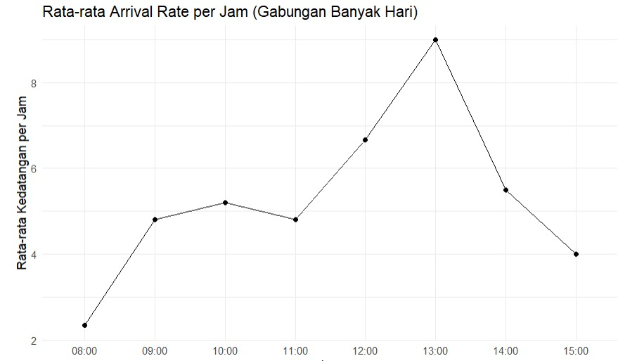
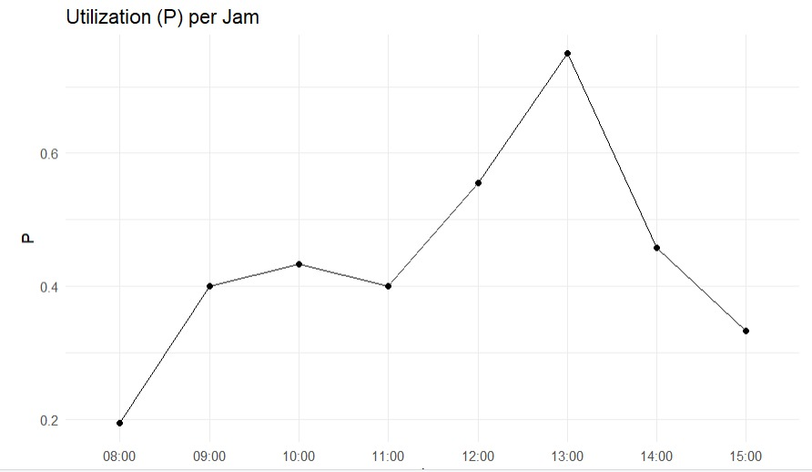
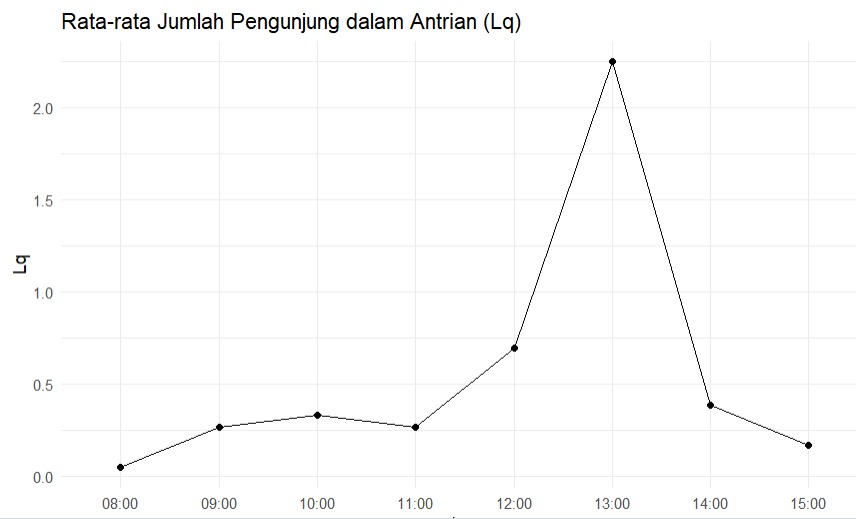

# 📚 Pemodelan Sistem Antrian Pelayanan Peminjaman Tugas Akhir di Perpustakaan GK2 ITERA

[](https://itera.ac.id/)
[](https://github.com)
[](https://github.com)

> Analisis kinerja sistem antrian pada layanan peminjaman Tugas Akhir menggunakan Model M/M/1

---

## 👥 Tim Peneliti - Kelompok 6 (Kelas RB)

| Nama | NIM |
|------|-----|
| <a href="https://github.com/asdoyi" target="_blank"></a> Asa Doa Uyi | 122450005 | 
| <a href="https://github.com/febiyajomy28" target="_blank"></a> Febiya Jomy Pratiwi | 122450074 | 
| <a href="https://github.com/mine2710" target="_blank"></a> Sofyan Fauzi Dzaki Arif | 122450116 | 
| <a href="https://github.com/zeeyachan" target="_blank"></a> Nabila Zakiyah Zahra | 122450139 |


**Dosen Pengampu:**
- Mika Alvionita S, M.Si
- Indah Suciati, M.Mat

**Program Studi Sains Data**  
**Fakultas Sains**  
**Institut Teknologi Sumatera**

---

## 📋 Daftar Isi

- [Tentang Proyek](#-tentang-proyek)
- [Video Penjelasan](#-video-penjelasan)
- [Latar Belakang](#-latar-belakang)
- [Metode Penelitian](#-metode-penelitian)
- [Hasil Penelitian](#-hasil-penelitian)
- [Struktur Repository](#-struktur-repository)
- [Instalasi & Penggunaan](#-instalasi--penggunaan)
- [Visualisasi Data](#-visualisasi-data)
- [Kesimpulan](#-kesimpulan)
- [Referensi](#-referensi)

---

## 🎯 Tentang Proyek

Penelitian ini menganalisis kinerja sistem antrian pada layanan peminjaman Tugas Akhir (TA) di Perpustakaan GK2 Institut Teknologi Sumatera menggunakan **Model M/M/1**. Tujuan utama adalah mengidentifikasi periode ketidakefisienan layanan dan memberikan rekomendasi berbasis data untuk optimasi sistem perpustakaan.

### 🔑 Kata Kunci
`Sistem Antrian` · `Model M/M/1` · `Perpustakaan` · `Teori Antrian` · `Optimasi Layanan`

---

## 🎥 Video Penjelasan

[](https://www.youtube.com/watch?v=QszSsrRNc8A)

---

## 🌟 Latar Belakang

Perpustakaan GK2 ITERA merupakan pusat sumber belajar vital yang menyediakan layanan peminjaman Tugas Akhir untuk mendukung mahasiswa tingkat akhir. Fenomena antrian yang tidak terkendali mengindikasikan:

- ⚠️ Potensi ketidakefisienan dalam alokasi sumber daya
- 📊 Perlunya analisis sistematis berbasis data
- 🎓 Pentingnya kelancaran akses literatur akademik

**Mengapa Model M/M/1?**

Model ini dipilih karena:
- ✅ Sesuai dengan layanan satu jalur (single channel)
- ✅ Pola kedatangan pengunjung bersifat acak (Poisson)
- ✅ Waktu pelayanan mengikuti distribusi eksponensial
- ✅ Struktur matematis sederhana namun akurat

---

## 🔬 Metode Penelitian

### 📅 Periode Pengamatan
**6 Oktober - 10 Oktober 2025** (1 minggu)

### 📊 Jenis Data

#### 1. Data Premier
- Observasi langsung aktivitas kedatangan pengunjung
- Pencatatan waktu pelayanan real-time
- Dokumentasi pola antrian

#### 2. Data Sekunder
Catatan administrasi perpustakaan meliputi:

| Kolom | Keterangan |
|-------|------------|
| `Timestamp` | Waktu kedatangan (mm/dd/yyyy hh:mm:ss) |
| `Email Address` | Email peminjam |
| `Nama Lengkap` | Identitas peminjam |
| `NIM/NIP/NRK` | Nomor identitas |
| `Judul Tugas Akhir` | Judul TA yang dipinjam |
| `Tahun Terbit TA` | Tahun publikasi |
| `No. Urut TA` | Nomor urut katalog |
| `Keterangan` | Status peminjaman |
| `No. HP/WA` | Kontak peminjam |
| `Jurusan/Prodi TA` | Asal program studi |

### 📐 Variabel Penelitian

#### Input (Independen)
- **λ (Lambda)**: Laju kedatangan pengunjung per menit
- **μ (Mu)**: Laju pelayanan per menit (μ = 12)

#### Output (Dependen)
- **P**: Tingkat pemanfaatan pelayanan (Utilization)
- **Lq**: Jumlah rata-rata pengunjung dalam antrian
- **Wq**: Waktu tunggu rata-rata dalam antrian
- **Ls**: Jumlah rata-rata pengunjung dalam sistem
- **Ws**: Total waktu rata-rata dalam sistem

---

## 📈 Hasil Penelitian

### 🎯 Temuan Utama

#### Tabel Ukuran Keefektifan Sistem

| Shift | Waktu | Arrival Rate (λ) | Service Rate (μ) | P (%) | Lq | Wq (jam) | Ls | Ws (jam) |
|-------|-------|------------------|------------------|-------|----|---------|----|----------|
| Pagi | 08:00-09:00 | 2.33 | 12 | **19.4%** | 0.047 | 0.020 | 0.241 | 0.103 |
| Pagi | 09:00-10:00 | 4.80 | 12 | 40.0% | 0.267 | 0.056 | 0.667 | 0.139 |
| Pagi | 10:00-11:00 | 5.20 | 12 | 43.3% | 0.331 | 0.064 | 0.765 | 0.147 |
| Pagi | 11:00-12:00 | 4.80 | 12 | 40.0% | 0.267 | 0.056 | 0.667 | 0.139 |
| Istirahat | 12:00-13:00 | 6.67 | 12 | 55.6% | 0.694 | 0.104 | 1.250 | 0.188 |
| Siang | **13:00-14:00** | **9.00** | 12 | **75.0%** 🔴 | **2.250** | **0.250** | **3.000** | **0.333** |
| Siang | 14:00-15:00 | 5.50 | 12 | 45.8% | 0.388 | 0.071 | 0.846 | 0.154 |
| Siang | 15:00-16:00 | 4.00 | 12 | 33.3% | 0.167 | 0.042 | 0.500 | 0.125 |

### 🔍 Interpretasi Hasil

#### ✅ **Periode Efisien** (08:00-09:00)
- Tingkat pemanfaatan: **19.4%** (sangat rendah)
- Antrian rata-rata: **~0 orang**
- Waktu tunggu: **1.2 menit**
- **Status**: Sistem underutilized, pelayanan sangat lancar

#### ⚠️ **Periode Kritis** (13:00-14:00)
- Tingkat pemanfaatan: **75%** (mendekati saturasi)
- Antrian rata-rata: **2-3 orang**
- Waktu tunggu: **15 menit**
- **Status**: Beban tertinggi, potensi ketidakpuasan pengguna

#### 📊 **Insight Operasional**
1. **Jam puncak** terjadi setelah waktu istirahat siang
2. **Perbedaan beban** signifikan antar waktu pelayanan
3. Sistem masih **stabil** (P < 1) namun mendekati kapasitas maksimal
4. Diperlukan **strategi redistribusi** beban pelayanan

---

## 📁 Struktur Repository

```
📦 pemodelan-stokastik-perpustakaan/
┣ 📂 data/
┃ ┗ 📄 waktu_tunggu_perpustakaan.csv
┣ 📂 docs/
┃ ┣ 📄 Laporan_6_RB.pdf
┃ ┗ 📄 PEMSTOK_Art_A1.pdf (Poster)
┣ 📂 src/
┃ ┗ 📄 codeR_6_RB.Rmd
┣ 📂 results/
┃ ┣ 📊 arrival_rate_plot.png
┃ ┣ 📊 utilization_plot.png
┃ ┗ 📊 queue_metrics_plot.png
┣ 📄 README.md
┗ 📄 .gitignore
```

---

## 🚀 Instalasi & Penggunaan

### Prerequisites

Pastikan Anda telah menginstal:
- R (versi ≥ 4.0.0)
- RStudio (opsional, namun direkomendasikan)

### Package R yang Dibutuhkan

```r
install.packages(c(
  "readr",
  "dplyr",
  "lubridate",
  "ggplot2"
))
```

### Langkah-Langkah Eksekusi

#### 1️⃣ Clone Repository

```bash
git clone https://github.com/username/pemodelan-stokastik-perpustakaan.git
cd pemodelan-stokastik-perpustakaan
```

#### 2️⃣ Load Data

```r
library(readr)
data <- read_csv("data/waktu_tunggu_perpustakaan.csv")
```

#### 3️⃣ Preprocessing

```r
library(dplyr)
library(lubridate)

# Konversi timestamp
data$Timestamp <- as.POSIXct(data$Timestamp, 
                             format = "%m/%d/%Y %H:%M:%S")

# Extract jam
data$Hour <- floor_date(data$Timestamp, unit = "hour")
```

#### 4️⃣ Hitung Metrik M/M/1

```r
service_rate <- 12  # μ = 12 per jam

arrival_rate_per_hour <- data %>%
  group_by(Hour) %>%
  summarise(arrival_rate = n(), .groups = "drop") %>%
  mutate(
    P  = arrival_rate / service_rate,
    Lq = (arrival_rate^2) / (service_rate * (service_rate - arrival_rate)),
    Wq = arrival_rate / (service_rate * (service_rate - arrival_rate)),
    Ls = arrival_rate / (service_rate - arrival_rate),
    Ws = 1 / (service_rate - arrival_rate)
  )
```

#### 5️⃣ Visualisasi

```r
library(ggplot2)

# Plot Arrival Rate
ggplot(arrival_rate_per_hour, aes(x = Hour, y = arrival_rate)) +
  geom_line(color = "steelblue", size = 1) +
  labs(title = "Arrival Rate per Jam",
       x = "Jam",
       y = "Jumlah Kedatangan") +
  theme_minimal()
```

---

## 📊 Visualisasi Data

### Grafik Arrival Rate per Jam



*Menunjukkan pola kedatangan pengunjung dengan puncak di jam 13:00-14:00*

### Grafik Utilization (P)



*Tingkat pemanfaatan tertinggi 75% pada jam 13:00-14:00*

### Grafik Queue Length (Lq)



*Panjang antrian maksimal 2.25 orang pada jam sibuk*

---

## 💡 Kesimpulan

### Temuan Utama

1. **Perbedaan Beban Signifikan**
   - Variasi tingkat pemanfaatan dari 19% hingga 75%
   - Pola kedatangan tidak merata sepanjang hari

2. **Periode Kritis Teridentifikasi**
   - Jam 13:00-14:00: Beban tertinggi, waktu tunggu 15 menit
   - Jam 08:00-09:00: Sistem underutilized

3. **Sistem Masih Stabil**
   - Semua nilai P < 1 (sistem tidak overload)
   - Namun mendekati kapasitas pada jam puncak

### 🎯 Rekomendasi

#### Untuk Manajemen Perpustakaan:

1. **📅 Redistribusi Sumber Daya**
   - Tambahkan petugas pada jam 13:00-14:00
   - Implementasi sistem shift yang lebih fleksibel

2. **⏰ Manajemen Waktu**
   - Promosikan jam-jam sepi (08:00-09:00)
   - Sistem booking untuk mengurangi antrian

3. **🔄 Optimasi Proses**
   - Evaluasi prosedur peminjaman
   - Implementasi sistem digital/self-service

#### Untuk Penelitian Lanjutan:

1. Eksplorasi model **M/M/s** (multiple server)
2. Analisis variasi waktu pelayanan lebih detail
3. Simulasi berbagai skenario konfigurasi layanan
4. Studi faktor eksternal (jadwal kuliah, deadline, dll)

---

## 📚 Referensi

1. Agustina, Y. & Aminudin (2019). "Mengukur Efektivitas Dan Pemodelan Sistem Antrian"
2. Pratama, E. (2025). "Analisis Sistem Antrian Satu Server (M/M/1)"
3. Khispan, D.A. (2025). "Analisis Model Antrian M/M/1 pada Sistem Pelayanan"
4. Putri, S.N.P.N. (2024). "Model Antrian dan Simulasi untuk Meningkatkan Pengalaman Pelanggan"
5. Wanti, E. (2022). "Perancangan Sistem Antrian Peminjaman Buku di Perpustakaan"

📖 **Lihat daftar referensi lengkap di [Laporan Lengkap](docs/Laporan_6_RB.pdf)**

---

## 🙏 Acknowledgments

Terima kasih kepada:
- **Perpustakaan GK2 ITERA** atas akses data dan dukungan penelitian
- **Dosen Pembimbing** atas bimbingan dan arahan
- **Tim Kelompok 6** atas kolaborasi yang solid

---

<div align="center">

**⭐ Jika proyek ini bermanfaat, jangan lupa berikan star! ⭐**

Made with ❤️ by Kelompok 6 - Pemodelan Stokastik RB

[⬆ Kembali ke atas](#-pemodelan-sistem-antrian-pelayanan-peminjaman-tugas-akhir-di-perpustakaan-gk2-itera)

</div>
